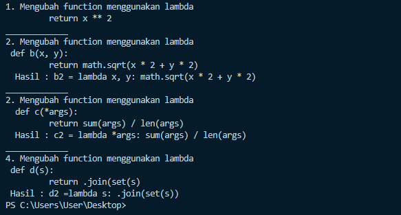

# Bahasa-Pemrograman-P10
Dibuat untuk memenuhi tugas Bahasa Pemrograman pertemuan 10

<br>NAMA        : AGUSTIN AFAREL
<br>NIM         : 312010081
<br>Kelas       : TI.20.B.1
<br>Mata Kuliah : Bahasa Pemrograman

 # TUGAS LATIHAN
``` python
def a(x):
    return x ** 2


a2 = lambda x: x ** 2


print("1. Mengubah function menggunakan lambda \n \t return x ** 2")


def b(x, y):
    return math.sqrt(x * + y * 2)


b2 = lambda x, y: math.sqrt(x * + y * 2)

print("_____________")
print("2. Mengubah function menggunakan lambda \n def b(x, y): \n \t return math.sqrt(x * 2 + y * 2)")
print("  Hasil : b2 = lambda x, y: math.sqrt(x * 2 + y * 2)")


def c(*args):
    return sum(args) / len(args)


c2 = lambda *args: sum(args) / len(args)

print("_____________")
print("2. Mengubah function menggunakan lambda \n  def c(*args): \n \t return sum(args) / len(args)")
print("  Hasil : c2 = lambda *args: sum(args) / len(args)")


def d(s):
    return "".join(set(s))


d2 = lambda s: "".join(set(s))

print("_____________")
print("4. Mengubah function menggunakan lambda \n def d(s): \n \t return "".join(set(s)")
print(" Hasil : d2 =lambda s: "".join(set(s))")

```
* HASIL SOURCE CODE DI ATAS SEBAGAI BERIKUT


# TUGAS PRAKTIKUM
